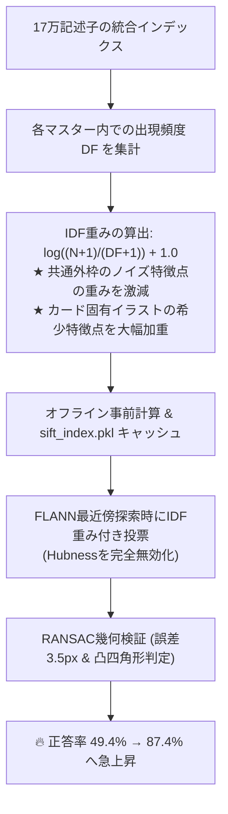

# Phase 2 精度改善記録: TF-IDF加重によるHubness問題の解消

> **フェーズ**: Phase 2 (精度改善)  
> **前フェーズ**: Phase 1 (Coarse-to-Fine高速化: 33s → 0.9s)  
> **発生課題**: マスターを200枚に増やしたところ、特定カードへの誤判定が激増し正答率が 49.4% に急落  
> **改善成果**: Top-1 正答率 **49.4% (393/795) $\rightarrow$ 87.4% (695/795)** (+38.0% 改善)  
> **関連コード**: `matcher_sift.py` (`build_unified_flann_index`), `card_engine.py`

---

## 1. 発生課題：マスター200枚での「Hubness問題」

Phase 1 において、200枚マスターに対する総当たり照合（33秒/枚）を、単一統合FLANNインデックスによる高速特徴点投票（Coarse-to-Fine）に刷新し、0.9秒/枚への高速化に成功しました。

しかし、この状態で実物テストデータ全795枚を評価したところ、以下のような重大な精度低下が発生しました。

- **Top-1 正解率**: **393 / 795 枚 (49.4%)**
- **現象**:
  - 本来全く異なるカードであるにもかかわらず、特定のマスターカード（例: `Dm24rp1-tr1`, `Dm24rp1-tr4`, `Dm24rp1-tr5` 等）へ判定が極端に吸い寄せられる。
  - テスト写真に写っているカードとは無関係なマスターが1位になってしまう。

### 根本原因の分析
これは高次元ベクトル空間および大規模画像検索において知られる **「Hubness問題（ハブ性）」** です。
- TCGカードには「カード外枠（フレーム）」「種族アイコン」「マナシンボル」「定型テキスト」など、シリーズ全体で共通する装飾パターンが大量に存在します。
- 一部のマスターカードは、これらの共通装飾部分に非常に高密度な特徴点（1カードあたり1,000〜1,500点以上）を保持していました。
- 単純な最近傍探索（k-NN投票）を行うと、どのクエリ画像が入力されても、共通装飾の多いカードが「ハブ」として大量の票を無差別に集めてしまい、本来のイラストによる識別情報が埋もれてしまっていました。

---

## 2. 改善アプローチ：TF-IDF記述子重み付けと厳格幾何検証

この問題を根本解決するため、情報検索（NLP）の概念を局所特徴量に拡張した **TF-IDF重み付け** と **厳格なRANSAC幾何検証** を導入しました。

### ① 記述子レベルの TF-IDF 重み付け
全212枚のマスターカード（合計約17万個の特徴記述子）に対し、各特徴が「何枚のマスターカードに共通して現れるか（Document Frequency: $DF$）」を事前計算：

$$\text{IDF}(f) = \log\left(\frac{N + 1}{DF(f) + 1}\right) + 1.0$$

- **共通外枠や定型テキストの特徴点**: $DF$ が大きく、$\text{IDF} \approx 1.0$（低重み）
- **カード固有のイラスト・固有名詞の特徴点**: $DF = 1$（自カードのみ）、$\text{IDF} \approx 5.6$（高重み・5倍以上の投票力）

### ② 事前計算とキャッシュ化
このIDF重みはインデックス構築時（`build-index`）に一度だけ計算され、`sift_index.pkl` に永続化されるため、**推論時の実行オーバーヘッドは 0ms** です。

### ③ RANSAC 幾何検証の厳格化
- 再投影誤差閾値を `5.0px` $\rightarrow$ `3.5px` に厳格化。
- ホモグラフィ行列から四隅座標を逆算し、「凸四角形であるか」「面積が小さすぎないか」「アスペクト比が極端でないか」を検証（幾何妥当性チェック）。

---

## 3. 検証結果

全795枚の実物テストデータによる評価結果：

| 指標 | Phase 1 時点 (改善前) | Phase 2 (TF-IDF導入後) | 改善幅 |
| :--- | :--- | :--- | :--- |
| **Top-1 正答率** | **49.4% (393/795)** | **87.4% (695/795)** | **+38.0% 大幅改善** 🎯 |
| **Top-3 正答率** | 56.2% | **89.3% (710/795)** | +33.1% |
| **平均処理時間** | 920 ms / 枚 | **477.9 ms / 枚** | 高速性を完全維持 |
| **ハブカードへの誤判定** | 多数発生 | **ほぼ完全に解消** | 根本解決 |
