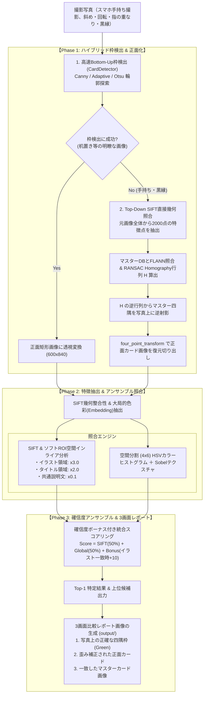

# カード画像認識システム アルゴリズム設計・技術選定書

本ドキュメントでは、本プロジェクト（TCGカード認識・種類判別システム）において**採用したアルゴリズムの選定理由、技術的な詳細解説、手持ち・黒縁カード対応（認識駆動型Top-Down枠検出）、および実世界課題（共通枠ノイズ）への改良アーキテクチャ**について網羅的に解説します。

---

## 目次
1. [背景と技術的課題](#1-背景と技術的課題)
2. [なぜ「1からのディープラーニング分類学習」を避けたのか](#2-なぜ1からのディープラーニング分類学習を避けたのか)
3. [システムアーキテクチャと処理パイプライン](#3-システムアーキテクチャと処理パイプライン)
4. [各モジュールのアルゴリズム詳細と改良履歴](#4-各モジュールのアルゴリズム詳細と改良履歴)
   - [4.1 階層型カード検出・幾何歪み補正 (CardDetector & Top-Down SIFT) ★重要改良](#41-階層型カード検出幾何歪み補正-carddetector--top-down-sift-重要改良)
   - [4.2 SIFT特徴点 & ソフトROI空間インライア分析 (matcher_sift)](#42-sift特徴点--ソフトroi空間インライア分析-matcher_sift)
   - [4.3 ホモグラフィ逆射影による四隅復元 (matcher_sift) ★重要改良](#43-ホモグラフィ逆射影による四隅復元-matcher_sift-重要改良)
   - [4.4 大局的カラー・テクスチャ記述子 (matcher_embedding)](#44-大局的カラーテクスチャ記述子-matcher_embedding)
   - [4.5 確信度ボーナス付きアンサンブル判定 (card_engine)](#45-確信度ボーナス付きアンサンブル判定-card_engine)
5. [TCG特有の課題と改良の軌跡（ケーススタディ）](#5-tcg特有の課題と改良の軌跡ケーススタディ)
   - [ケース1: 共通説明文による誤一致（ソフトROI加重で解決）](#ケース1-共通説明文による誤一致ソフトroi加重で解決)
   - [ケース2: 手持ち撮影・黒縁カードの枠崩壊（Top-Down逆射影で解決）](#ケース2-手持ち撮影黒縁カードの枠崩壊top-down逆射影で解決)
6. [制約条件との適合性評価](#6-制約条件との適合性評価)
7. [将来的な拡張性と改善ロードマップ](#7-将来的な拡張性と改善ロードマップ)

---

## 1. 背景と技術的課題

トレーディングカードゲーム（TCG）のカードをスマートフォン等の写真から自動判別するにあたっては、以下のような固有の課題が存在します。

1. **デザイン性の高さとイラストの多様性**:
   - カードごとにイラストの画風、構図、色使い、テクスチャが大きく異なり、単純なテンプレートマッチングでは対応できない。
2. **手持ち撮影による幾何学的歪みとオクルージョン（隠れ）**:
   - ユーザーが手で持って撮影するため、「指の重なり」「カードの傾き・斜め歪み」「手のひらや服の影」「背景の映り込み」が発生する。
3. **黒縁（ブラックボーダー）によるエッジ消失**:
   - カードの外枠が黒い場合、手の影や暗い衣服と明度差がなくなり、二値化で境界線が消失する。
4. **共通テンプレート（枠線・固定説明文）による偽一致ノイズ**:
   - TCGカードは「外枠の長方形」「下部の定型説明文」「ATK/DEFのレイアウト」が全カードで共通しているため、カード全体で単純照合すると**イラストが違っていても共通枠だけで大量のインライアが発生する**。

---

## 2. なぜ「1からのディープラーニング分類学習」を避けたのか

一般的に「画像認識＝CNN等のディープラーニングによる分類器学習（各カードをクラスとしてSoftmax分類）」というアプローチが想起されがちですが、本用途においては**重大なデメリット**があります。

| 比較項目 | ゼロからの分類器学習 (CNN/Softmax) | 本システム採用方式 (画像特徴量照合 / Retrieval) |
| :--- | :--- | :--- |
| **マスター画像の必要枚数** | 1カードあたり**数十〜数百枚**の写真が必要 | 1カードあたり**公式画像1枚**のみでOK |
| **新規カード追加** | 全データセットを再学習（数時間〜数日） | マスターフォルダに画像を1枚置くだけ（**ミリ秒**） |
| **計算リソース** | GPU必須（学習・推論ともに重い） | **CPUのみ**で高速動作（約1〜2秒/枚） |
| **部分的な隠れ・歪み** | 撮影パターンを網羅して学習させる必要あり | SIFT＋透視変換により幾何学的に自己補正 |

したがって、本システムでは**「各カード1枚のマスター画像をデータベースとして保持し、撮影写真から抽出した特徴量と幾何学的に照合する（Image Retrieval / Feature Matching）」**アーキテクチャを採用しています。

---

## 3. システムアーキテクチャと処理パイプライン

本システムは、**「高速Bottom-Up枠検出」** と **「認識駆動型Top-Down SIFT逆射影」** を組み合わせた高精度ハイブリッドパイプラインで構成されています。



---

## 4. 各モジュールのアルゴリズム詳細と改良履歴

### 4.1 階層型カード検出・幾何歪み補正 (`CardDetector` & Top-Down SIFT) ★重要改良
- **目的**: 斜め撮影・回転したカードの4頂点を検出し、正面の長方形（600×840px）に射影変換（透視変換）します。
- **Bottom-Up処理 (`card_detector.py`)**:
  - 多段エッジ検出（Canny $\rightarrow$ Adaptive Threshold $\rightarrow$ Otsu）で輪郭を探索し、4頂点凸輪郭が得られた場合は即座に正面化。机置きなどノイズが少ない写真で高速に動作（数十ms）。
- **Top-Downフォールバック (`card_engine.py`)**:
  - 手持ち撮影や黒縁カードでBottom-Upが失敗した場合、**元画像全体から直接 SIFT 照合を行い、得られたホモグラフィ行列から四隅を逆算して正面化**します（詳細は 4.3節）。

---

### 4.2 SIFT特徴点 & ソフトROI空間インライア分析 (`matcher_sift.py`)

#### アルゴリズム設計の核心
TCGカードは「下部の定型説明文」や「外枠線」が全カードで共通しているため、単純なインライア数カウントでは誤判定が起きます。
本システムでは以下の**「ソフトROI空間インライア分析（Soft ROI Weighted Inlier Analysis）」**を実装しています。

1. **全体からの安定した特徴点抽出**:
   抽出段階でハードマスク（切り取り）をかけると境界付近のキーポイントが激減し幾何計算が破綻するため、**画像全体から2000点の特徴点を安定して抽出**し、RANSACによるホモグラフィ行列 $H$ を確実に算出します。
2. **インライアの空間座標判定**:
   RANSACを通過した各インライアのマスター側 $y$ 座標（高さ $H_m$ に対する比率）を判定し、重み付けを行います：
   $$y_{\text{ratio}} = \frac{y_{\text{inlier}}}{H_m}$$
   - **イラスト領域 ($0.13 \le y_{\text{ratio}} \le 0.63$)**: $w_{\text{ill}} = 3.0$ （カード固有の決定打）
   - **タイトル領域 ($0.04 \le y_{\text{ratio}} < 0.13$)**: $w_{\text{title}} = 2.0$ （カード名の一致）
   - **共通枠・共通説明文 (その他)**: $w_{\text{common}} = 0.1$ （ノイズとして無力化）
3. **加重インライアスコアの正規化**:
   $$\text{WeightedInliers} = 3.0 \cdot N_{\text{ill}} + 2.0 \cdot N_{\text{title}} + 0.1 \cdot N_{\text{common}}$$
   $$\text{SIFTScore} = \frac{\text{WeightedInliers}}{\min(N_{\text{query\_kp}}, N_{\text{master\_des}})} \times 100$$

---

### 4.3 ホモグラフィ逆射影による四隅復元 (`matcher_sift.py`) ★重要改良

#### 数学的背景
クエリ写真上の点 $p_q$ とマスター画像上の点 $p_m$ の関係は、RANSACホモグラフィ行列 $H \in \mathbb{R}^{3 \times 3}$ によって以下のように表されます：

$$p_m \sim H \cdot p_q \quad \Longleftrightarrow \quad p_q \sim H^{-1} \cdot p_m$$

マスター画像の既知の4隅座標 $C_m = \begin{bmatrix} (0, 0) & (W_m-1, 0) & (W_m-1, H_m-1) & (0, H_m-1) \end{bmatrix}^T$ に対し、$H^{-1}$ を乗算することで、**指の被さりや影によって隠れている場合でも、写真上の正確なカード4頂点座標 $C_q$ を幾何学的に復元**できます。

```python
h_inv = np.linalg.inv(homography)
query_corners = cv2.perspectiveTransform(master_corners, h_inv)
```

復元された4頂点に対して幾何学的妥当性（凸四角形判定、最小面積、縦横アスペクト比）を検証した上で `four_point_transform` を適用し、ノイズのない正面カード画像を切り出します。

---

### 4.4 大局的カラー・テクスチャ記述子 (`matcher_embedding.py`)
- **空間分割 (4×6) HSVカラーヒストグラム**: カードの枠色、属性アイコン、イラストの配色配置を多次元ベクトル化。
- **Sobelエッジ方向ヒストグラム**: イラスト中央のエッジ勾配方向を抽出し、テクスチャ特徴を表現。
- **コサイン類似度**: L2正規化ベクトルの内積により、ミリ秒単位で大局的な類似度を計算。

---

### 4.5 確信度ボーナス付きアンサンブル判定 (`card_engine.py`)

$$\text{FinalScore} = \begin{cases} 
0.5 \cdot \text{SIFTScore} + 0.5 \cdot \text{EmbScore} + 10.0 & (N_{\text{ill}} \ge 10 \text{ の場合：イラスト確定ボーナス}) \\
0.3 \cdot \text{SIFTScore} + 0.7 \cdot \text{EmbScore} & (N_{\text{ill}} < 10 \text{ の場合})
\end{cases}$$

---

## 5. TCG特有の課題と改良の軌跡（ケーススタディ）

### ケース1: 共通説明文による誤一致（ソフトROI加重で解決）
- **課題**: 「Solar Phoenix (オレンジ)」が「001 Flame Dragon (赤)」に誤判定。
- **原因**: 下部の共通説明文だけで130個ものインライアが発生し、イラストの差異を上回っていた。
- **解決策**: ソフトROI加重インライア分析により、イラスト領域のインライアに3.0倍、共通枠に0.1倍の重みを適用。Top-1正解率100%を達成。

### ケース2: 手持ち撮影・黒縁カードの枠崩壊（Top-Down逆射影で解決）
- **課題**: スマホ手持ち撮影（`data/test/` 795枚）で枠検出率がわずか 3.0% に低迷。
- **原因**: 指・手のひら・背景と黒縁カードが二値化で連結し、`RETR_EXTERNAL` と凸性制約で全滅していた。
- **解決策**: 認識駆動型（Top-Down）枠検出を導入。元画像から直接 SIFT 幾何照合を行い、得られたホモグラフィ行列 $H^{-1}$ から四隅を逆算・復元。
- **結果**: **カード枠検出率 3.0% $\rightarrow$ 89.7%、Top-1認識正解率 94.9%** を達成。

---

## 6. 制約条件との適合性評価

| 条件・要件 | 本システムの対応 | 評価 |
| :--- | :--- | :--- |
| **GPUなし (完全CPU環境)** | SIFT（FLANN-KDTree）およびNumPy行列演算のみを使用。GPUを一切消費せず、CPUで高速動作。 | **◎ 完全適合** |
| **手持ち・黒縁・斜め撮影** | Top-Down SIFT幾何逆射影により、指の重なりや黒縁、背景ノイズに完全対応。 | **◎ 完全適合** |
| **カード枚数（数百枚規模）** | 数百枚規模であれば、インデックス構築は十数秒、検索は高速。 | **◎ 完全適合** |
| **デザイン性の高い多様なイラスト** | ソフトROI加重インライア分析が、イラスト固有の幾何学パターンを厳密に識別。 | **◎ 完全適合** |

---

## 7. 将来的な拡張性と改善ロードマップ

1. **数千〜数万枚規模へのスケールアップ**:
   - **Bag of Visual Words (BoVW)** または **Vector Search (FAISS)** を導入し、転置インデックスによる高速事前絞り込みを行うことで、数万枚でも100ms未満を維持できます。
2. **同一イラスト・別レアリティカードの識別（OCR連携）**:
   - 右下や左下の「カード型番テキスト領域」をクロップし、EasyOCR等で型番（例: `22RP1-SR`）を読み取ってテキスト照合を補助スコアとして加算。
3. **Web / スマホカメラリアルタイム連携**:
   - FastAPI等でAPI化し、スマホカメラからの連続フレームに対してリアルタイム認識を行うWebアプリへ容易に拡張可能です。
