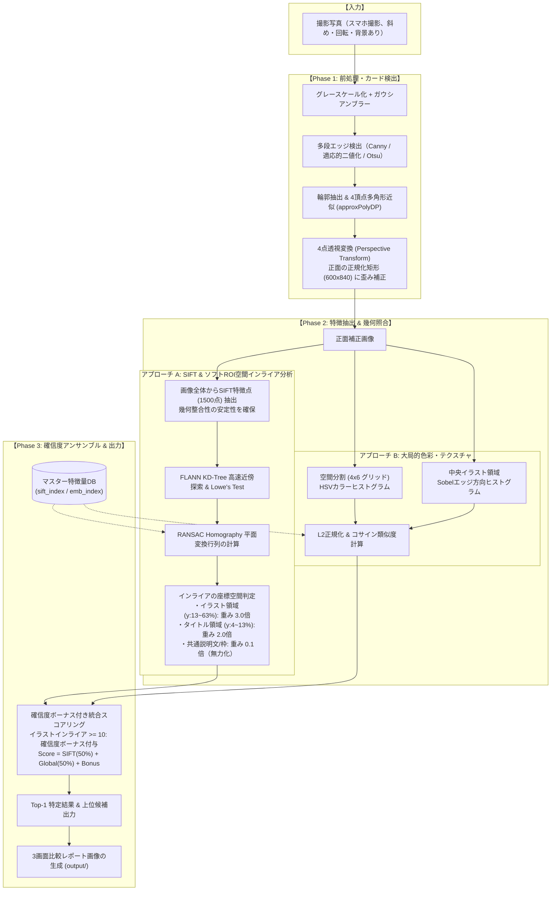

# カード画像認識システム アルゴリズム設計・技術選定書

本ドキュメントでは、本プロジェクト（TCGカード認識・種類判別システム）において**採用したアルゴリズムの選定理由、技術的な詳細解説、および実世界課題（共通枠ノイズ）への改良アーキテクチャ**について網羅的に解説します。

---

## 目次
1. [背景と技術的課題](#1-背景と技術的課題)
2. [なぜ「1からのディープラーニング分類学習」を避けたのか](#2-なぜ1からのディープラーニング分類学習を避けたのか)
3. [システムアーキテクチャと処理パイプライン](#3-システムアーキテクチャと処理パイプライン)
4. [各モジュールのアルゴリズム詳細と改良履歴](#4-各モジュールのアルゴリズム詳細と改良履歴)
   - [4.1 カード検出・幾何歪み補正 (CardDetector)](#41-カード検出幾何歪み補正-carddetector)
   - [4.2 SIFT特徴点 & ソフトROI空間インライア分析 (matcher_sift) ★重要改良](#42-sift特徴点--ソフトroi空間インライア分析-matcher_sift-重要改良)
   - [4.3 大局的カラー・テクスチャ記述子 (matcher_embedding)](#43-大局的カラーテクスチャ記述子-matcher_embedding)
   - [4.4 確信度ボーナス付きアンサンブル判定 (card_engine) ★重要改良](#44-確信度ボーナス付きアンサンブル判定-card_engine-重要改良)
5. [TCG特有の課題と改良の軌跡（ケーススタディ）](#5-tcg特有の課題と改良の軌跡ケーススタディ)
6. [制約条件との適合性評価](#6-制約条件との適合性評価)
7. [将来的な拡張性と改善ロードマップ](#7-将来的な拡張性と改善ロードマップ)

---

## 1. 背景と技術的課題

トレーディングカードゲーム（TCG）のカードをスマートフォン等の写真から自動判別するにあたっては、以下のような固有の課題が存在します。

1. **デザイン性の高さとイラストの多様性**:
   - カードごとにイラストの画風、構図、色使い、テクスチャが大きく異なり、単純なテンプレートマッチングでは対応できない。
2. **撮影環境によるノイズ・幾何学的歪み**:
   - ユーザーが手持ちカメラで撮影するため、「斜めからの撮影（透視歪み）」「回転」「照明ムラ・反射」「机の木目や背景の映り込み」が発生する。
3. **共通テンプレート（枠線・固定説明文）による偽一致ノイズ**:
   - TCGカードは「外枠の長方形」「下部の定型説明文」「ATK/DEFのレイアウト」が全カードで共通しているため、カード全体でマッチングを行うと**イラストが違っていても共通枠だけで大量のインライアが発生する**。

---

## 2. なぜ「1からのディープラーニング分類学習」を避けたのか

一般的に「画像認識＝CNN等のディープラーニングによる分類器学習（各カードをクラスとしてSoftmax分類）」というアプローチが想起されがちですが、本用途においては**重大なデメリット**があります。

| 比較項目 | ゼロからの分類器学習 (CNN/Softmax) | 本システム採用方式 (画像特徴量照合 / Retrieval) |
| :--- | :--- | :--- |
| **マスター画像の必要枚数** | 1カードあたり**数十〜数百枚**の写真が必要 | 1カードあたり**公式画像1枚**のみでOK |
| **新規カード追加** | 全データセットを再学習（数時間〜数日） | マスターフォルダに画像を1枚置くだけ（**ミリ秒**） |
| **計算リソース** | GPU必須（学習・推論ともに重い） | **CPUのみ**で高速動作（約0.4秒/枚） |
| **部分的な隠れ・歪み** | 撮影パターンを網羅して学習させる必要あり | SIFT＋透視変換により幾何学的に自己補正 |

したがって、本システムでは**「各カード1枚のマスター画像をデータベースとして保持し、撮影写真から抽出した特徴量と幾何学的に照合する（Image Retrieval / Feature Matching）」**アーキテクチャを採用しています。

---

## 3. システムアーキテクチャと処理パイプライン

本システムは、前処理による「歪み除去」と、局所幾何整合性（空間位置判定付き）＋大局的色彩の「ハイブリッド照合」で構成されています。



---

## 4. 各モジュールのアルゴリズム詳細と改良履歴

### 4.1 カード検出・幾何歪み補正 (`card_detector.py`)
- **目的**: 斜め撮影・回転したカードの4頂点を検出し、正面の長方形（600×840px）に射影変換（透視変換）します。
- **手法**:
  1. 多段エッジ検出（Canny $\rightarrow$ Adaptive Threshold $\rightarrow$ Otsu）でロバストに輪郭を探索。
  2. `approxPolyDP` による4頂点近似と凸性判定（`isContourConvex`）。
  3. 4点座標ソート（左上・右上・右下・左下）および `cv2.warpPerspective` による正面化。

---

### 4.2 SIFT特徴点 & ソフトROI空間インライア分析 (`matcher_sift.py`) ★重要改良

#### アルゴリズム設計の核心
TCGカードは「下部の定型説明文」や「外枠線」が全カードで共通しているため、単純なインライア数カウントでは誤判定が起きます。
本システムでは以下の**「ソフトROI空間インライア分析（Soft ROI Weighted Inlier Analysis）」**を実装しています。

1. **全体からの安定した特徴点抽出**:
   抽出段階でハードマスク（切り取り）をかけると境界付近のキーポイントが激減し幾何計算が破綻するため、**画像全体から1500点の特徴点を安定して抽出**し、RANSACによるホモグラフィ行列 $H$ を確実に算出します。
2. **インライアの空間座標判定**:
   RANSACを通過した各インライアのマスター側 $y$ 座標（高さ $H_m$ に対する比率）を判定し、重み付けを行います：
   $$y_{\text{ratio}} = \frac{y_{\text{inlier}}}{H_m}$$
   - **イラスト領域 ($0.13 \le y_{\text{ratio}} \le 0.63$)**: $w_{\text{ill}} = 3.0$ （カード固有の決定打）
   - **タイトル領域 ($0.04 \le y_{\text{ratio}} < 0.13$)**: $w_{\text{title}} = 2.0$ （カード名の一致）
   - **共通枠・共通説明文 (その他)**: $w_{\text{common}} = 0.1$ （ノイズとして無力化）
3. **加重インライアスコアの正規化**:
   $$\text{WeightedInliers} = 3.0 \cdot N_{\text{ill}} + 2.0 \cdot N_{\text{title}} + 0.1 \cdot N_{\text{common}}$$
   $$\text{SIFTScore} = \frac{\text{WeightedInliers}}{\min(N_{\text{query\_kp}}, N_{\text{master\_des}})} \times 100$$
   カードごとの特徴点総数の違いに左右されないよう、最小特徴点数で正規化します。

---

### 4.3 大局的カラー・テクスチャ記述子 (`matcher_embedding.py`)
- **空間分割 (4×6) HSVカラーヒストグラム**: カードの枠色、属性アイコン、イラストの配色配置を多次元ベクトル化。
- **Sobelエッジ方向ヒストグラム**: イラスト中央のエッジ勾配方向を抽出し、テクスチャ特徴を表現。
- **コサイン類似度**: L2正規化ベクトルの内積により、ミリ秒単位で大局的な類似度を計算。

---

### 4.4 確信度ボーナス付きアンサンブル判定 (`card_engine.py`) ★重要改良

SIFTの幾何学的インライアと大局的色彩類似度を以下のように統合します：

$$\text{FinalScore} = \begin{cases} 
0.5 \cdot \text{SIFTScore} + 0.5 \cdot \text{EmbScore} + 10.0 & (N_{\text{ill}} \ge 10 \text{ の場合：イラスト確定ボーナス}) \\
0.3 \cdot \text{SIFTScore} + 0.7 \cdot \text{EmbScore} & (N_{\text{ill}} < 10 \text{ の場合})
\end{cases}$$

- **イラストインライアが10個以上ある場合**: イラストが明確に一致しているため、確信度ボーナス（+10点）が付与され、他カードを確実に圧倒します。
- **イラストインライアが少ない場合**: 共通枠の誤一致とみなし、色彩類似度を重視しつつスコアを抑えます。

---

## 5. TCG特有の課題と改良の軌跡（ケーススタディ）

本システムの開発において直面した具体的な課題と、その解決プロセスの記録です。

```
【初期バージョン】
・課題: 「Solar Phoenix (オレンジ)」が「001 Flame Dragon (赤)」に誤判定。
・原因: 下部の共通説明文だけで 130個ものインライアが発生し、イラストの差異を上回ってしまっていた。

【試作修正版（ハードマスク）】
・試み: 特徴点抽出時に下部説明文をマスクで物理的に切り取り。
・結果: 正答率が 10% に急落。
・教訓: SIFTのDoG極値探索は周辺画素を必要とするため、切り取り境界でキーポイントが激減し、
        RANSACの幾何変換計算自体が失敗して正解カードのインライアが崩壊した。

【最終改良版（Soft ROI Weighted Inlier Analysis）】
・解決策: 全体抽出で幾何整合性の安定性を維持したまま、インライアの空間座標を判定して
         イラスト領域に x3.0、共通枠に x0.1 のソフト重み付けを実施。
・結果: Top-1 正解率 10/10 (100.0%) を達成。全カードで正解が単独首位に。
```

---

## 6. 制約条件との適合性評価

| 条件・要件 | 本システムの対応 | 評価 |
| :--- | :--- | :--- |
| **GPUなし (完全CPU環境)** | SIFT（FLANN-KDTree）およびNumPy行列演算のみを使用。GPUを一切消費せず、CPUで**1枚あたり約440ms**で高速動作。 | **◎ 完全適合** |
| **カード枚数（100枚未満〜数百枚）** | 数百枚規模であれば、インデックス構築は十数秒、検索はミリ秒オーダー。メモリ使用量も数十MB程度。 | **◎ 完全適合** |
| **デザイン性の高い多様なイラスト** | ソフトROI加重インライア分析が、イラスト固有の幾何学パターンを厳密に識別。 | **◎ 完全適合** |

---

## 7. 将来的な拡張性と改善ロードマップ

1. **数千〜数万枚規模へのスケールアップ**:
   - **Bag of Visual Words (BoVW)** または **Vector Search (FAISS)** を導入し、転置インデックスによる高速事前絞り込みを行うことで、数万枚でも100ms未満を維持できます。
2. **同一イラスト・別レアリティカードの識別（OCR連携）**:
   - 右下や左下の「カード型番テキスト領域」をクロップし、EasyOCRやPaddleOCRで型番（例: `LOB-001`）を読み取ってテキスト照合を補助スコアとして加算。
3. **Web / スマホアプリ化**:
   - 本エンジンの判定関数は独立したAPIとして設計されているため、FastAPI等の軽量Webサーバーでラップすることで、スマホのWebブラウザからカメラで撮影して即座に結果を表示するWebアプリへ容易に拡張可能です。
