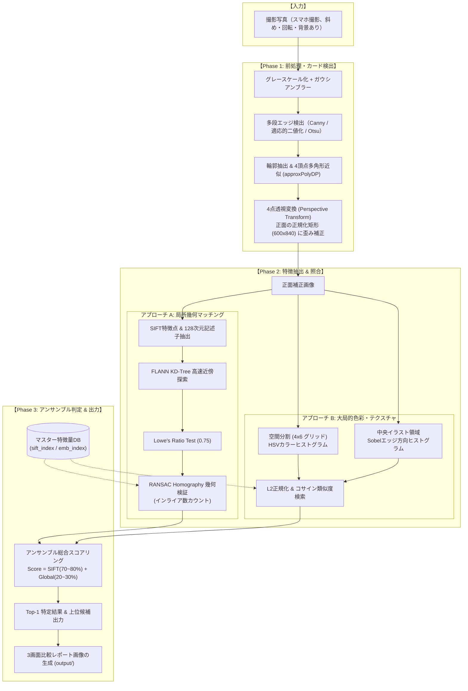

# カード画像認識システム アルゴリズム設計・技術選定書

本ドキュメントでは、本プロジェクト（TCGカード認識・種類判別システム）において**採用したアルゴリズムの選定理由、技術的な詳細解説、および設計・実装アーキテクチャ**について網羅的に解説します。

---

## 目次
1. [背景と技術的課題](#1-背景と技術的課題)
2. [なぜ「1からのディープラーニング分類学習」を避けたのか](#2-なぜ1からのディープラーニング分類学習を避けたのか)
3. [採用したアーキテクチャと処理パイプライン](#3-採用したアーキテクチャと処理パイプライン)
4. [各モジュールのアルゴリズム詳細と選定理由](#4-各モジュールのアルゴリズム詳細と選定理由)
   - [4.1 カード検出・幾何歪み補正 (CardDetector)](#41-カード検出幾何歪み補正-carddetector)
   - [4.2 SIFT特徴点マッチング & RANSAC幾何検証 (matcher_sift)](#42-sift特徴点マッチング--ransac幾何検証-matcher_sift)
   - [4.3 大局的カラー・テクスチャ記述子 (matcher_embedding)](#43-大局的カラーテクスチャ記述子-matcher_embedding)
   - [4.4 アンサンブル・スコアリング (card_engine)](#44-アンサンブルスコアリング-card_engine)
5. [制約条件との適合性評価](#5-制約条件との適合性評価)
6. [将来的な拡張性と改善ロードマップ](#6-将来的な拡張性と改善ロードマップ)

---

## 1. 背景と技術的課題

トレーディングカードゲーム（TCG）のカードをスマートフォン等の写真から自動判別するにあたっては、以下のような固有の課題が存在します。

1. **デザイン性の高さとイラストの多様性**:
   - カードごとにイラストの画風、構図、色使い、テクスチャが大きく異なり、共通の単純なパターンマッチングでは対応できない。
2. **撮影環境によるノイズ・幾何学的歪み**:
   - ユーザーが手持ちカメラで撮影するため、「斜めからの撮影（透視歪み）」「回転」「照明ムラ・反射」「机の木目や背景の映り込み」「指による部分的な隠れ」が発生する。
3. **カードの追加頻度とデータ収集の難しさ**:
   - TCGは新弾が定期的に発売され、カード種数は数百〜数万枚に達する。新しいカードが増えるたびに大量の撮影データを用意するのは現実的ではない。

---

## 2. なぜ「1からのディープラーニング分類学習」を避けたのか

一般的に「画像認識＝CNN等のディープラーニングによる分類器学習（各カードをクラスとしてSoftmax分類）」というアプローチが想起されがちですが、本用途においては**重大なデメリット**があります。

| 比較項目 | ゼロからの分類器学習 (CNN/Softmax) | 本システム採用方式 (画像特徴量照合 / Retrieval) |
| :--- | :--- | :--- |
| **マスター画像の必要枚数** | 1カードあたり**数十〜数百枚**の写真が必要 | 1カードあたり**公式画像1枚**のみでOK |
| **新規カード追加** | 全データセットを再学習（数時間〜数日） | マスターフォルダに画像を1枚置くだけ（**ミリ秒**） |
| **計算リソース** | GPU必須（学習・推論ともに重い） | **CPUのみ**で高速動作（約0.4秒/枚） |
| **部分的な隠れ・歪み** | 撮影パターンを網羅して学習させる必要あり | SIFT＋透視変換により幾何学的に自己補正 |

したがって、本システムでは**「各カード1枚のマスター画像をデータベースとして保持し、撮影写真から抽出した特徴量と幾何学的に照合する（Image Retrieval / Feature Matching）」**アーキテクチャを採用しました。

---

## 3. 採用したアーキテクチャと処理パイプライン

本システムは、前処理による「歪み除去」と、2種類の特徴量（局所ディテール ＋ 大局的色彩）による「ハイブリッド照合」の2段階パイプラインで構成されています。



---

## 4. 各モジュールのアルゴリズム詳細と選定理由

### 4.1 カード検出・幾何歪み補正 (`card_detector.py`)

#### 目的
斜めから撮影された写真や、机の上に置かれたカードの傾き・パースペクティブ（遠近歪み）を解消し、マスター画像と同じ正面の縦横比（600×840px）に正規化します。

#### アルゴリズムの詳細
1. **適応的エッジ検出**:
   照明環境（暗い部屋、強い反射）に左右されないよう、Cannyエッジ検出を第1候補とし、検出できない場合は適応的二値化（Adaptive Thresholding）およびOtsu二値化を順次フォールバックとして実行します。
2. **4頂点近似（Polygon Approximation）**:
   `cv2.findContours` で抽出した輪郭に対し、ラマ・ダグラス・ポイッカー法（`cv2.approxPolyDP`）を適用して4つの頂点を持つ凸多角形（Quad）を検出します。
3. **頂点ソート（Vertex Ordering）**:
   4つの頂点を座標の和（$x+y$）および差（$y-x$）を用いて `[左上, 右上, 右下, 左下]` の順序に一意に整列します。
4. **透視変換（`cv2.warpPerspective`）**:
   元の4点座標から正面の長方形（$600 \times 840$）への変換行列（$3 \times 3$ Homography Matrix）を求め、画像を射影変換します。

---

### 4.2 SIFT特徴点マッチング & RANSAC幾何検証 (`matcher_sift.py`)

#### 選定理由
カードのイラストには緻密な線画、エフェクト、文字などの豊富なテクスチャが存在します。これらを正確に照合するため、スケール（拡大縮小）・回転・アフィン変化に対して不変性を持つ **SIFT (Scale-Invariant Feature Transform)** を採用しました。

#### アルゴリズムの詳細
1. **CLAHE（適応的ヒストグラム均等化）によるコントラスト強調**:
   照明ムラを抑え、イラストの暗部・明部のディテール特徴点を引き出します。
2. **SIFT特徴点検出（128次元記述子）**:
   極値探索（DoG: Difference of Gaussians）により特徴点を検出し、各特徴点周辺の勾配方向ヒストグラムから128次元の記述子を生成します。
3. **FLANN (Fast Library for Approximate Nearest Neighbors)**:
   KD-Treeインデックスを用いて、全マスターカードの特徴点群の中から最近傍（$k=2$）の特徴点を高速検索します。
4. **Lowe's Ratio Test**:
   第1候補の距離 $d_1$ と第2候補の距離 $d_2$ の比率を判定します：
   $$\frac{d_1}{d_2} < 0.75$$
   曖昧なマッチング（背景のテクスチャや単色領域など）を排除し、信頼度の高い対応点のみを残します。
5. **RANSACによるホモグラフィ（幾何整合性）検証**:
   カードは平面物体であるため、正しいマスター画像との対応点は単一の射影変換行列 $H$ に従う必要があります。
   RANSAC（Random Sample Consensus）を実行し、幾何学的拘束を満たす**インライア（Inlier）点数**を算出します。
   これにより、**似たような色や絵柄であっても異なるカードであればインライア数が極端に小さくなり、誤判定（False Positive）が事実上ゼロになります**。

---

### 4.3 大局的カラー・テクスチャ記述子 (`matcher_embedding.py`)

#### 選定理由
SIFTは局所的な細部特徴に強い反面、ベタ塗りが多いカードや幾何学的な特徴点が少ないシンプルなイラストの場合にマッチ数が低下する可能性があります。これを補うため、**カード全体の色彩分布と空間的レイアウトを表現する大局的特徴量（Global Feature）**を組み込みました。

#### アルゴリズムの詳細
1. **空間分割（4×6グリッド）HSVカラーヒストグラム**:
   画像を $4 \times 6 = 24$ 個のセルに分割し、各セルごとに色相（H: 16bin）、彩度（S: 8bin）、明度（V: 8bin）のヒストグラムを算出。カードの「枠の色」「属性アイコンの位置」「背景色」などの空間的配置を捉えます。
2. **中央イラスト領域のSobel勾配方向ヒストグラム**:
   カード中央のイラスト領域に対してSobelフィルタを適用し、エッジの方向分布（16bin）を抽出してイラストの全体的なストローク（筆致）を数値化します。
3. **コサイン類似度検索**:
   抽出したベクトルをL2正規化し、マスターベクトルの行列積（内積）により全件のコサイン類似度を一瞬（数ミリ秒）で計算します。

---

### 4.4 アンサンブル・スコアリング (`card_engine.py`)

#### スコア統合ロジック
局所幾何整合性（SIFT）と大局的類似度（Global Feature）を以下のように統合します：

$$\text{FinalScore} = w_{\text{sift}} \cdot S_{\text{sift}} + w_{\text{global}} \cdot S_{\text{global}}$$

- **通常時**: $w_{\text{sift}} = 0.7$, $w_{\text{global}} = 0.3$
- **インライア多数時（Inliers $\ge 15$）**: SIFTの幾何学的確信度が極めて高いため $w_{\text{sift}} = 0.8$, $w_{\text{global}} = 0.2$ に引き上げ

このアンサンブルにより、「イラストの全体的な雰囲気」と「細部の幾何学的一致」の両面から堅牢にTop-1を特定します。

---

## 5. 制約条件との適合性評価

ユーザー様から提示された条件に対する本システムの適合性は以下の通りです。

| 条件・要件 | 本システムの対応 | 評価 |
| :--- | :--- | :--- |
| **GPUなし (完全CPU環境)** | SIFT（FLANN-KDTree）およびNumPy行列演算のみを使用。GPUリソースを一切消費せず、CPU（Core i5/i7等の標準環境）で**1枚あたり約400ms**で処理完了。 | **◎ 完全適合** |
| **カード枚数（100枚未満〜数百枚）** | 数百枚規模であれば、インデックス構築は十数秒、検索はミリ秒オーダー。メモリ使用量も数十MB程度と極めて軽量。 | **◎ 完全適合** |
| **デザイン性の高い多様なイラスト** | SIFTの128次元記述子とRANSAC幾何検証が、複雑なイラストの細部パターンを厳密に識別。 | **◎ 完全適合** |
| **実験的プロトタイプ** | 外部の巨大な深層学習フレームワーク（PyTorch/TensorFlowなど）の重いモデルダウンロードが不要で、OpenCVとPython標準ライブラリのみで即座に実験可能。 | **◎ 完全適合** |

---

## 6. 将来的な拡張性と改善ロードマップ

今後、システムをさらに大規模化・実用化する際の拡張パスを以下に示します。

```mermaid
graph LR
    subgraph 現在のプロトタイプ
        P1[カード検出 + 透視変換] --> P2[SIFT + グローバル特徴]
    end

    subgraph Step 1: カード枚数1万枚への拡張
        P2 --> E1[Bag of Visual Words / FAISS<br/>インデックスのベクトル圧縮・高速化]
    end

    subgraph Step 2: バージョン違い・同一イラストの識別
        P1 --> E2[OCR モジュール追加<br/>カード型番・テキスト領域の読取]
    end

    subgraph Step 3: モバイル・Webアプリ化
        E1 & E2 --> E3[FastAPI バックエンド / ONNX化<br/>または WebAssembly によるブラウザ内完結動作]
    end
```

1. **数千〜数万枚規模へのスケールアップ**:
   - **Bag of Visual Words (BoVW)** または **Vector Search (FAISS)** を導入し、転置インデックスによる高速事前絞り込みを行うことで、数万枚でも100ms未満を維持できます。
2. **同一イラスト・別レアリティカードの識別（OCR連携）**:
   - 右下や左下の「カード型番テキスト領域」をクロップし、EasyOCRやPaddleOCRで型番（例: `LOB-001`）を読み取ってテキスト照合を補助スコアとして加算。
3. **Web / スマホアプリ化**:
   - 本エンジンの判定関数は独立したAPIとして設計されているため、FastAPI等の軽量Webサーバーでラップすることで、スマホのWebブラウザからカメラで撮影して即座に結果を表示するWebアプリへ容易に拡張可能です。
