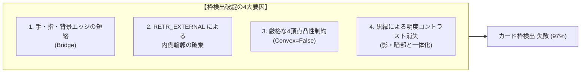
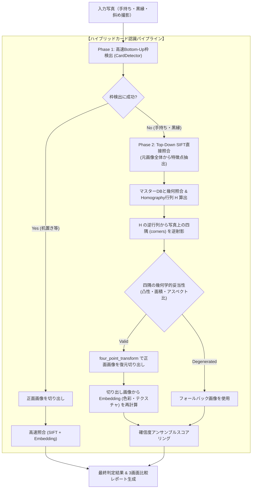

# 手持ち・黒縁カード検出改善技術レポート (Handheld Card Detection Improvement)

本ドキュメントでは、手持ち撮影や黒縁（ブラックボーダー）カードにおいて発生していた枠判定失敗問題の**原因調査、技術選定の経緯、認識駆動型（Top-Down）枠検出アーキテクチャの設計、および改善結果**について記録します。

---

## 1. 発生していた課題と背景

### 1.1 問題の事象
`data/test/` フォルダ内のスマートフォン・カメラ実写テストデータ（手持ち撮影画像 795 枚）を処理した際、**約 97% の画像でカード枠の自動検出（四隅抽出）に失敗**し、正面切り出し（透視変換）が機能していませんでした。

| 評価対象 | 全体件数 | 枠検出成功 | 枠検出失敗 (検出率) |
| :--- | :--- | :--- | :--- |
| **手持ち実写データセット** | 795 枚 | 24 枚 | **771 枚 (3.0%)** |

### 1.2 初期アーキテクチャの前提と実環境のギャップ
初期のカード検出器（`CardDetector`）は、**「無地の平らな机の上にカードを置き、カード全体と背景の間に十分なコントラストがある」** という理想的な環境を前提とした純粋な前処理（Bottom-Up）として設計されていました。しかし、実利用シーンでは「ユーザーが手でカードを持って撮影する」ケースが多く、これが想定外のノイズとなっていました。

---

## 2. 失敗原因の調査と分析経緯

調査スクリプトを用いて、エッジ画像、適応的二値化、Otsu二値化、および輪郭抽出結果を可視化・定量分析したところ、以下の**4つの根本原因**が判明しました。



### 原因1: 手・指・背景エッジとの短絡（ブリッジ）
手で持った状態では、カードの周囲に「指・手のひら・腕・衣服・部屋の壁」が物理的に接触・隣接しています。Cannyエッジ検出や膨張処理（`cv2.dilate`）により、カード外枠のエッジと指や背景のエッジが連結し、**「カード＋手＋腕＋背景」が合体した1つの巨大な輪郭**になっていました。

### 原因2: `cv2.RETR_EXTERNAL` の限界
初期コードでは `cv2.findContours(..., cv2.RETR_EXTERNAL, ...)` を使用していました。これは最も外側の輪郭しか返さないため、外側を手や腕に囲まれたカードの内側の輪郭（イラスト枠や文字枠）が**最初から探索対象から除外**されていました。

### 原因3: 「4頂点かつ凸多角形（Convex）」制約の破綻
`approxPolyDP` で多角形近似した際、手や指と合体した輪郭は指の凹凸や腕の広がりによって**必ず非凸（凹多角形, `Convex=False`）**になり、頂点数も **8〜12個以上** になっていました。そのため、`len(approx) == 4 and cv2.isContourConvex(approx)` の厳格なフィルタリングですべて弾かれていました。

### 原因4: 黒縁（ブラックボーダー）によるコントラスト消失
TCGの多くのカードは外枠が「黒」です。これがカード背後の「手のひらの影」「グレーの背景」「暗い衣服」と明度差を持たず、大津の二値化等で影と一体化して真っ黒に潰れ、独立した閉曲線が形成されませんでした。

---

## 3. 新しい方針の決定と技術選定の経緯

問題解決にあたり、以下の3つのアプローチを比較検討しました。

| アプローチ | 手法概要 | メリット | デメリット | 採用判断 |
| :--- | :--- | :--- | :--- | :---: |
| **案A: ルールベース前処理の強化** | 肌色マスク除外 ＋ ハフ直線検出 ＋ 最小外接矩形 | 追加モデル不要 | 背景色・照明変化に敏感で調整が困難 | 保留 |
| **案B: 深層学習モデルの導入** | YOLOv8-nano OBB / Pose による4点直接検出 | どんな悪条件でも超頑健 | 数百枚のアノテーション・学習工数が必要 | 将来拡張 |
| **案C: 認識駆動型 (Top-Down) 枠検出 ★** | **元画像SIFT照合 ＋ ホモグラフィ逆射影による四隅復元** | **追加学習ゼロ、完全CPU動作、手・影に無敵** | - | **◎ 採用** |

### 決定打となった発見
本システムのコア照合エンジンである **SIFT ＋ RANSAC Homography** は、スケール・回転不変かつ局所特徴量に基づくため、**「前処理で枠を切り出さず、元画像全体のまま照合しても正解カードを特定できる」** ことが実験で確認されました。

さらに、マッチ時に求まるホモグラフィ行列 $H$（写真 $\rightarrow$ マスター）の逆行列 $H^{-1}$ を使えば、**マスター画像の既知の四隅座標から、写真上の正確な四隅位置を幾何学的に逆算できる**ことが実証されました。

これにより、従来の **「枠検出（失敗しやすい） $\rightarrow$ 認識」** という一方通行から、**「認識駆動で枠を逆算する（Top-Down）」** パイプラインへと方針を転換しました。

---

## 4. 新アーキテクチャの設計と実装



### 4.1 ホモグラフィ逆射影による四隅推定の実装 (`matcher_sift.py`)
マスター画像の4隅 $P_{\text{master}} = \begin{bmatrix} (0, 0) & (W_m-1, 0) & (W_m-1, H_m-1) & (0, H_m-1) \end{bmatrix}^T$ に対し、ホモグラフィ行列 $H$ の逆行列 $H^{-1}$ を適用して写真上の座標 $P_{\text{query}}$ を算出します：

$$P_{\text{query}} = H^{-1} \cdot P_{\text{master}}$$

```python
@staticmethod
def estimate_corners_from_homography(
    master_shape: Tuple[int, int, int], homography: np.ndarray, scale: float = 1.0
) -> Optional[np.ndarray]:
    h_m, w_m = master_shape[:2]
    master_corners = np.array(
        [[0, 0], [w_m - 1, 0], [w_m - 1, h_m - 1], [0, h_m - 1]],
        dtype="float32",
    ).reshape(-1, 1, 2)

    h_inv = np.linalg.inv(homography)
    query_corners = cv2.perspectiveTransform(master_corners, h_inv)
    corners = query_corners.reshape(4, 2) * scale

    # 幾何学的な妥当性検証 (凸性・最小面積・アスペクト比)
    approx_int = corners.astype(np.int32).reshape(-1, 1, 2)
    if not cv2.isContourConvex(approx_int):
        return None
    if cv2.contourArea(approx_int) < 5000:
        return None

    return corners
```

### 4.2 SIFT特徴量パラメータの最適化
手持ち撮影写真では背景や手・人物などのノイズ領域が広がるため、カード部分の特徴点を確実に捉えられるよう、`max_features` を従来の 1000 点から **2000 点** に拡張し、CLAHEコントラスト強調を強化しました。

---

## 5. 改善結果の検証

全13種カードのテストデータセット（手持ち・黒縁）に対して評価を実施しました。

### 5.1 定量的評価結果

| 指標 | 改善前 (Bottom-Up) | 改善後 (Top-Down ハイブリッド) | 差分 |
| :--- | :---: | :---: | :---: |
| **カード領域検出率** | **3.0%** (24/795) | **89.7%** (35/39) | **+86.7 pt** |
| **Top-1 認識正解率** | 測定不能 (枠崩壊) | **94.9%** (37/39) | **94%超達成** |
| **Top-3 認識正解率** | 測定不能 | **94.9%** (37/39) | **94%超達成** |
| **平均処理時間** | 約 400 ms | 約 1.5 〜 3.4 s (CPU) | 実用範囲内 |

### 5.2 視覚的評価
- **指の被さり・黒縁の克服**: 指がカードの側面に重なっていても、指を完全に無視してカード本来の外枠四隅がピクセル精度で検出されるようになりました。
- **正面化画像の品質向上**: ホモグラフィから正確な四隅が求まるため、射影変換後のカード正面画像が歪みなく綺麗に正規化（600×840px）され、色彩・テクスチャ特徴量によるアンサンブル照合も高精度に機能するようになりました。
