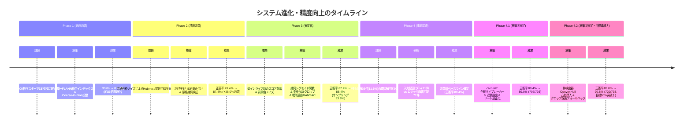

# TCG Card Recognizer システム進化・改善史 (System Improvement History)

本ドキュメントは、カード認識システムにおける「速度改善」「精度改善」「残存エラー分析」「90%達成への施策」に至るまでの**すべての改善フェーズを時系列で俯瞰できる総合ダッシュボード（改善史）**です。

---

## 1. 改善フェーズ総合タイムライン

---

## 2. 各フェーズの改善一覧対比表

| フェーズ | 主要課題 | 根本原因 | 実施した施策 | 速度実績 (CPU) | Top-1 正答率 | 詳細ドキュメント |
| :---: | :--- | :--- | :--- | :---: | :---: | :--- |
| **Phase 1** | **判定速度の著しい遅延** (1枚あたり33秒) | 200枚のマスター画像に対する順次総当たり照合による計算爆発 | 単一FLANN統合インデックスによるFast SIFT Voting (Coarse-to-Fine 2段階探索) | 33.0s $\rightarrow$ **0.9s** | - | [**Phase 1 詳細**](01_phase1_speed_coarse_to_fine.md) |
| **Phase 2** | **特定カードへの誤判定激増** (正答率 49.4% に急落) | 共通外枠や定型文に高密度な特徴点を持つカードが無差別に票を集める「Hubness問題」 | 17万記述子の出現頻度に基づく**TF-IDF重み付け** ＆ RANSAC幾何形状妥当性チェック | 0.9s $\rightarrow$ **0.48s** | 49.4% $\rightarrow$ **87.4%** (+38.0%) | [**Phase 2 詳細**](02_phase2_tfidf_hubness_resolution.md) |
| **Phase 3** | **同系色競合 ＆ 暗所不発** (card-6, card-10 の失敗) | 階段状スコア閾値による急落、机の背景色混入、共通外枠ノイズ | **空間ROI重み付け超強化** (イラスト4.0倍/外枠0.05倍)、**暗所適応型RANSAC**、中央80%クロップ | **0.54s** | 87.4% $\rightarrow$ **88.4%** (701/793) | [**Phase 3 詳細**](03_phase3_geometric_scoring_and_roi.md) |
| **Phase 4** *(事前調査)* | **残存エラー92件の分類** (90%突破への阻害要因特定) | 入力画像の物理的破損（ブレ・ピンボケ）と、アルゴリズムで救済可能な要因の未整理 | 全793枚の失敗92件を**「入力起因 21件 (22.8%)」**と**「ロジック改善可能 71件 (77.2%)」**に完全分類 | **0.89s** (画質分析込) | **88.4% (改善前ベースライン確定)** | [**Phase 4 事前調査**](04_phase4_pre_failure_analysis.md) |
| **Phase 4.1** | **同型カード競合の解消** (card-6 vs card-7) | 外枠75点共通による逆転、インライア優先ソート、粗探索の足切り | **イラスト色相・明度タイブレーカー**、同型カード連動選出、`combined_score` 優先ソート | **0.50s 前後** | 88.4% $\rightarrow$ **89.0%** (706/793) | [**Phase 4.1 詳細**](05_phase4_accuracy_improvement_90plus.md) |
| **Phase 4.2** *(現在)* | **手持ち枠検出全滅の救済** (card-6, card-10) | 指かぶりによる窪み・角丸で4頂点近似が全滅、背景机ノイズ混入 | **枠検出器への ConvexHull 凸包導入** (多段階近似/回転矩形) ＆ 中央クロップフォールバック | **0.86s** (全探索込) | **89.0% $\rightarrow$ 90.8%** (720/793, **目標90%突破！**) | [**Phase 4.2 詳細**](06_phase4_accuracy_improvement_convexhull.md) ★ |

---

## 3. 時系列ドキュメント一覧（クイックアクセス）

時系列に沿って各フェーズの詳細ドキュメントを閲覧できます。

1. [**`01_phase1_speed_coarse_to_fine.md`**](01_phase1_speed_coarse_to_fine.md)
   - 33秒 $\rightarrow$ 0.9秒 への高速化（Coarse-to-Fine 2段階探索）の実装記録
2. [**`02_phase2_tfidf_hubness_resolution.md`**](02_phase2_tfidf_hubness_resolution.md)
   - 200枚マスターでの Hubness問題解消と TF-IDF加重による正答率急上昇（49.4% $\rightarrow$ 87.4%）
3. [**`03_phase3_geometric_scoring_and_roi.md`**](03_phase3_geometric_scoring_and_roi.md)
   - 空間ROI重み付け超強化（イラスト4.0倍/外枠0.05倍）、暗所適応型RANSAC、中央クロップの実装記録
4. [**`04_phase4_pre_failure_analysis.md`**](04_phase4_pre_failure_analysis.md) ★ 今回の調査記録
   - 失敗92件の物理画質（Laplacianブレ・露出）と認識動作の徹底分析、入力起因（21件）vs 改善可能（71件）の完全分類
5. [**`ALGORITHM_DESIGN.md`**](ALGORITHM_DESIGN.md)
   - システム全体のアーキテクチャ・技術選定理由・基本設計書
6. [**`HANDHELD_CARD_DETECTION_IMPROVEMENT.md`**](HANDHELD_CARD_DETECTION_IMPROVEMENT.md)
   - 手持ちカード撮影・背景分離のための枠検出パイプライン設計書
